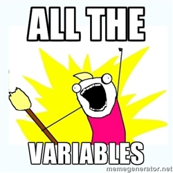
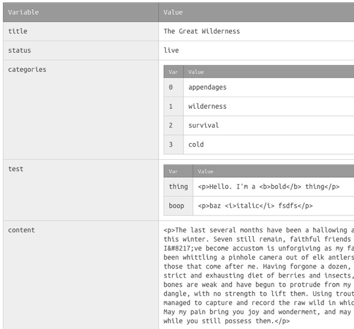

* Copy across `_add-ons/all_the_vars` to your Statamic installation.
* Throw an `{{ all_the_vars }}` tag anywhere in your template to see everything that's available to you.

It'll look like this:

By default, variables starting with underscores won't be shown. If you want to see *absolutely all the variables*, which includes them, add `remove_underscored="no"` to the tag.

Google Webfonts is used because I dislike boring fonts. If this is an issue, add `websafe_font="yes"`.

If you want to output *all the variables* as JSON, add `json_format="yes"` to the tag.

